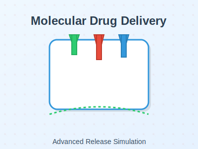

# Project 1: Drug Release Simulation
 
 
 
 
 ## Overview
 This project simulates and compares drug release kinetics for first-order and zero-order models using Python. It aims to provide insights into drug delivery systems relevant to biomedical engineering, particularly in microneedle technology.
 @@ -9,10 +9,48 @@ This project simulates and compares drug release kinetics for first-order and ze
 - Visualize and analyze drug release profiles over time.
 - Compare burst release (first-order) and sustained release (zero-order).
 
 ## Key Features
 - Simulates first-order and zero-order drug release kinetics.
 - Visualizes release profiles with easy-to-interpret graphs.
 - Highlights differences between burst and sustained release mechanisms.
 
 ## Tools Used
 - **Programming Languages:** Python
 - **Libraries:** NumPy, Matplotlib
 - **Techniques:** Mathematical modeling, data visualization
 
 ## Results
 
 
 - **First-Order Release:** Ideal for rapid drug delivery with an initial burst.
 - **Zero-Order Release:** Suitable for sustained, controlled delivery.
 
 ## How to Run
 1. Install Python and required libraries:
    ```bash
    pip install numpy matplotlib
    ```
 2. Run the script:
    ```bash
    python drug_release_simulation.py
    ```
 3. View the output graph and results.
 
 ## Future Scope
 - Expand the project to include more complex release models (e.g., diffusion-controlled or matrix-based systems).
 - Integrate experimental data from real-world drug delivery tests.
 - Add machine learning algorithms to predict release kinetics based on material properties.
 
 ## Contributions
 Contributions are welcome! Please fork the repository and submit a pull request.
 
 ## Repository Link
 [View Full Code on GitHub](https://github.com/YOUR_USERNAME/Drug_Release_Simulation)
 
 ## License
 This project is open-source and available for educational purposes.


