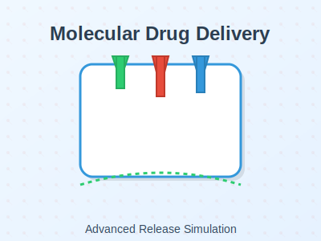
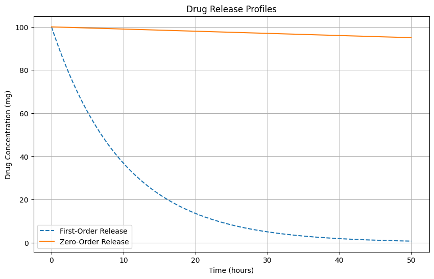

# 💊 Drug Release Simulation: First-Order vs. Zero-Order Kinetics

This project simulates and compares **drug release kinetics** using two fundamental models: **first-order (burst release)** and **zero-order (sustained release)**. These simulations are highly relevant to **microneedle-based delivery systems** in biomedical engineering.

---



[](https://colab.research.google.com/github/Reem-Aboutaleb/Drug_Release_Simulation/blob/main/drug_release_simulation.ipynb)

---


> **Keywords**: Drug Delivery, Kinetics, First-Order, Zero-Order, Biomedical Engineering, Microneedles, Python Modeling

---

## 📚 Table of Contents

- [Overview](#overview)
- [Objectives](#objectives)
- [Key Features](#key-features)
- [Tools Used](#tools-used)
- [Results](#results)
- [How to Run](#how-to-run)
- [Future Scope](#future-scope)
- [Contributions](#contributions)
- [License](#license)

---

## 🧠 Overview

Drug delivery systems rely on precise control over release rates. This simulation explores how first-order and zero-order kinetics behave under the same initial conditions — helping biomedical engineers evaluate which release model is better suited for different applications such as pain management or sustained hormone delivery.

---

## 🎯 Objectives

- Simulate first-order (burst) and zero-order (sustained) drug release kinetics  
- Visualize time-based release profiles  
- Compare behaviors across dose duration  
- Provide code for future modeling with real microneedle systems

---

## ✨ Key Features

- ✅ Simulates drug release over time for both kinetic models  
- ✅ Clear side-by-side graph for burst vs. sustained release  
- ✅ Modular Python code for easy editing  
- ✅ Clean plot output using Matplotlib

---

## 🛠 Tools Used

- **Languages**: Python 3.11  
- **Libraries**: NumPy, Matplotlib  
- **Concepts**: Pharmacokinetics, controlled release, mathematical modeling

---

## 📊 Results

### 📈 Release Profiles



- **First-Order**: Rapid initial release, then tapering  
- **Zero-Order**: Steady, controlled release over time  

These insights are crucial for determining drug delivery strategies in **microneedle-based patches, implants, or oral systems**.

---

## ▶️ How to Run

1. Clone the repository:
```bash
git clone https://github.com/Reem-Aboutaleb/Drug_Release_Simulation.git
cd Drug_Release_Simulation
```

2. Install dependencies:
```bash
pip install numpy matplotlib
```

3. Run the script:
```bash
python drug_release_simulation.py
```

Or launch the notebook via [Google Colab](https://colab.research.google.com/github/Reem-Aboutaleb/Drug_Release_Simulation/blob/main/drug_release_simulation.ipynb)

---

## 🔭 Future Scope

- Add **diffusion-based** and **matrix-based** release models  
- Integrate experimental drug release data for validation  
- Simulate **microneedle geometry effects** on delivery  
- Add ML model to **predict release profiles** from material properties

---

## 🤝 Contributions

Contributions are welcome!  
Fork the repo → make changes → submit a pull request 🙌

---

## 📄 License

This project is licensed under the [MIT License](LICENSE) and open for educational and non-commercial use.

---

⭐ *“Controlled drug release isn't just chemistry — it's engineering precision for better health.”*


